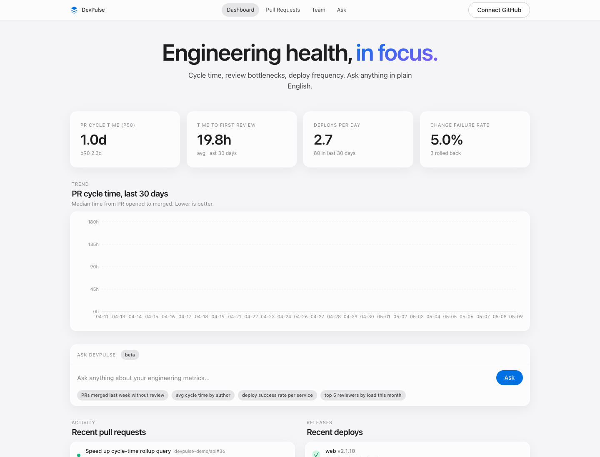
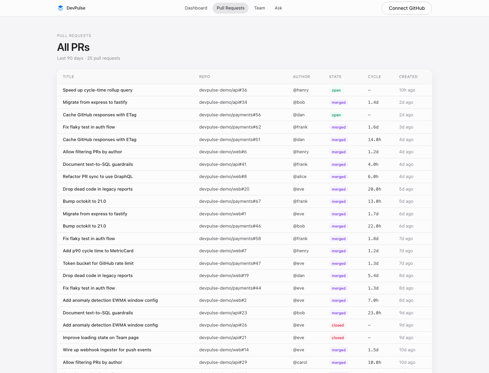
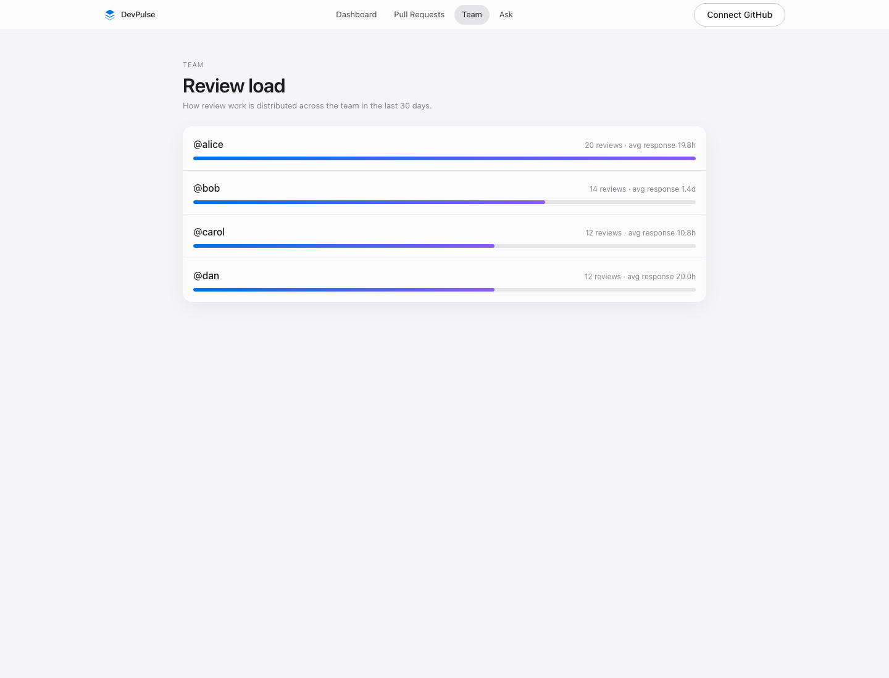
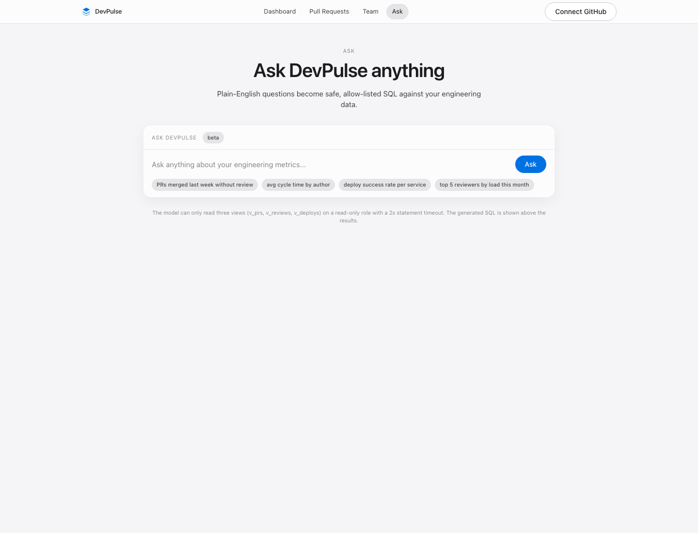

# DevPulse — AI-Integrated Developer Analytics Platform

A developer productivity platform that connects to GitHub and surfaces engineering metrics — PR cycle time, review bottlenecks, deploy frequency — alongside an LLM-powered query interface and anomaly detector. The analytics tool engineering managers wish they had.



## Screens

| | |
|---|---|
|  |  |
| **Pull Requests** — every PR with cycle time, state, author | **Team** — review load and avg response time per reviewer |
|  | |
| **Ask DevPulse** — text-to-SQL with AST-allow-listed views and a 2s read-only execution sandbox | |

## Why This Project

- **AI-integrated full-stack** is the new default in 2026 job postings
- DevTools/SaaS hiring is steady — every company has internal dashboards like this built by hand in spreadsheets
- Demonstrates the things interviewers actually probe: API + worker separation, queue-based ingestion, rate-limit handling, idempotent sync, time-series analytics, LLM integration with grounded data, and end-to-end testing

## What It Does

```
┌──────────────────────────────────────────────────────┐
│ DevPulse — Engineering Health Dashboard              │
│                                                      │
│ PR Cycle Time (p50)     Deploy Frequency             │
│ ┌───────────────┐       ┌───────────────┐            │
│ │    4.2 hrs    │       │  3.1 / day    │            │
│ │   ▼ 18% wow   │       │  ▲ 12% wow    │            │
│ └───────────────┘       └───────────────┘            │
│                                                      │
│ ⚠ Anomaly: review wait time on backend/* is 2.4σ    │
│   above 30-day baseline. Driven by 12 PRs queued     │
│   on @alice (avg 18hr first-response).               │
│                                                      │
│ Ask DevPulse:                                        │
│ > "which PRs merged last week without review?"       │
│ > "deploy success rate for the payments service"     │
│                                                      │
│ Recent Deploys                                       │
│ ✅ payments@v2.3.1  ✅ web@v8.1.0  ❌ api@v2.2.9 ↩  │
└──────────────────────────────────────────────────────┘
```

### Features

**Built and shipping:**
- **PR Analytics** — cycle time (p50/p90), time-to-first-review, review-wait excluding off-hours, force-push & rebase aware
- **Team Metrics** — review load per developer, average response time, contribution patterns
- **Deploy Tracking** — frequency, change failure rate, rollback rate
- **AI Query Interface** — natural-language questions answered via constrained text-to-SQL over an allow-listed view set, with the generated SQL shown to the user
- **EWMA baseline computation** — per-repo rolling baselines stored in `metric_baselines` (foundation for anomaly detection)
- **GitHub OAuth + GraphQL/REST sync** — token-bucket rate limiting, ETag-conditional requests, PR timeline reconstruction in the worker

**Designed but not yet built (see Roadmap):**
- Anomaly *detection* (z-score check + alerting) on top of the EWMA baselines
- Slack / email alerts when metrics breach thresholds
- GitHub webhook ingester for real-time updates (currently polling-only)

## Tech Stack (All Free-Tier)

| Component | Tool | Cost |
|---|---|---|
| Frontend | React + TanStack Query + Recharts on Vercel | $0 |
| API | Node.js + Fastify (TypeScript) on Render | $0 |
| Worker | Same image, separate process — BullMQ consumer | $0 |
| Queue | Upstash Redis (BullMQ) | $0 |
| Database | Neon PostgreSQL with `pg_partman` for time-series | $0 |
| GitHub Data | REST + GraphQL + Webhooks (5K req/hr authed) | $0 |
| LLM | Groq (Llama 3.3 70B) for insights, structured output for SQL | $0 |
| Auth | GitHub OAuth + signed session cookies | $0 |
| Observability | Pino structured logs (Better Stack / OpenTelemetry sinks ready to wire) | $0 |
| CI/CD | GitHub Actions (Postgres + Redis service containers) | $0 |

## Architecture

```
                    ┌──────────────┐
                    │   GitHub     │
                    └──────┬───────┘
                           │     REST/GraphQL
                           │        ▲
                           │        │ (rate-limited via token
                           │        │  bucket, ETag-conditional)
                           ▼        │
                     ┌──────────────┴───┐
                     │  BullMQ queue    │
                     │ (Redis)          │
                     └─────────┬────────┘
                               ▼
       ┌──────────────────────────────────────────┐
       │  Worker process                           │
       │  • incremental sync (since cursors)      │
       │  • PR timeline reconstruction            │
       │  • per-PR metric computation             │
       │  • EWMA baselines → metric_baselines     │
       └─────────────────┬────────────────────────┘
                         ▼
                 ┌───────────────┐
                 │   Postgres    │◀──── API (Fastify)
                 │               │      • /metrics/* (summary, trend, team, recent)
                 └───────────────┘      • /ask  (text-to-SQL with AST guardrail)
                         ▲              • /auth/github (OAuth + sessions)
                         │              • /repos
                         └─────── Frontend (React + TanStack Query)

(Planned: GitHub webhook ingester, anomaly scan, Slack alerts.)
```

### Repo Layout

```
devpulse/
├── apps/
│   ├── web/                    # React + Vite frontend
│   │   └── src/{pages,components,hooks,lib}/
│   ├── api/                    # Fastify HTTP API
│   │   └── src/{routes,middleware,schemas}/
│   └── worker/                 # BullMQ consumer (sync + rollups + anomalies)
│       └── src/{jobs,sync,rollups,anomaly}/
├── packages/
│   ├── db/                     # Kysely schema, migrations, query builders
│   ├── github/                 # Typed GitHub client (REST + GraphQL + webhooks)
│   ├── metrics/                # Pure metric computation — heavily unit-tested
│   └── ai/                     # Groq client, text-to-SQL guardrails, prompts
├── infra/
│   └── docker-compose.yml      # Postgres + Redis for local dev
└── .github/workflows/          # lint, typecheck, unit, integration (testcontainers)
```

## The Hard Parts (What Makes This Interview-Defensible)

**1. PR cycle time is not `merged_at - created_at`.** PRs go through draft → ready → review → changes-requested → re-review cycles, get force-pushed (which can hide commits), rebased onto main, and reopened. The metric engine reconstructs the event timeline from the PR's `timeline` API and computes:
- *time-to-first-review* — first non-author review after `ready_for_review`
- *review-wait* — sum of intervals where the ball was in a reviewer's court, excluding configured off-hours
- *coding time* — first commit on branch → ready_for_review

**2. GitHub's 5K req/hr limit forces a real ingestion design.** The worker uses conditional requests (`If-None-Match` with stored ETags), GraphQL for fan-out queries (one query for a PR's reviews + commits + timeline events), incremental sync with `since` cursors, and a token bucket to stay under the limit per installation. (A webhook ingester is on the roadmap — current implementation is polling-only.)

**3. Text-to-SQL with guardrails.** `/ask` sends the user's question + a curated schema prompt to Groq with structured-output enforcement. Generated SQL is parsed with `pgsql-ast-parser`, rejected if it touches anything outside an allow-listed view set, executed against a read-only role with a 2s statement timeout, and shown to the user before results render. No raw LLM output ever reaches the database.

**4. EWMA baselines as the foundation for honest anomaly detection.** Per (metric, repo) tuple, the worker maintains an EWMA + Welford's running stddev over a 30-day window in `metric_baselines`. The detector itself (alert when z > 2 *and* absolute change clears a per-metric floor) is on the roadmap — but the harder problem (numerically stable streaming statistics) is already solved and unit-tested. The next step is a 30-line scan job that reads baselines and writes alerts.

**5. Real unit tests, not theater.** 14 tests in `@devpulse/metrics` cover the PR timeline state machine (changes_requested handoff, weekend off-hours, force-push edge cases, out-of-order events) plus statistical primitives (percentile interpolation, Welford stddev matches numpy, EWMA boundaries). 10 tests in `@devpulse/ai` prove the SQL guardrail rejects DROP, DELETE, UPDATE, stacked queries, and subquery escapes — using AST parsing, not regex. Total: 24 tests, all passing in CI.

## Run Locally

```bash
# Prereqs: Node 20+, Docker (for Postgres/Redis), pnpm
cp .env.example .env            # fill in GITHUB_CLIENT_ID, GROQ_API_KEY (both optional for first run)
docker compose up -d            # local Postgres + Redis
pnpm install
pnpm db:migrate                 # apply schema
pnpm db:seed                    # seed ~80 PRs across 3 demo repos
pnpm dev                        # runs api (:4000), worker, web (:5173) in parallel
```

Open http://localhost:5173 — the dashboard renders against the seeded data
immediately. (If 5173 is in use, Vite picks the next free port — check the
terminal output.) Set `GITHUB_CLIENT_ID` / `GITHUB_CLIENT_SECRET` and the
"Connect GitHub" button in the nav goes live. Set `GROQ_API_KEY` and the
**Ask** page becomes functional.

> If `5432` or `6379` are taken on your machine (e.g. you already run
> Postgres or Redis locally), set `POSTGRES_HOST_PORT` / `REDIS_HOST_PORT`
> in your `.env` and update `DATABASE_URL` / `REDIS_URL` to match.

### Useful scripts

```bash
pnpm test           # vitest across packages (metrics + ai guardrail tests)
pnpm typecheck      # tsc --noEmit across the workspace
pnpm build          # production build of all packages
```

## Roadmap

- [ ] Multi-org support with per-installation rate-limit pools
- [ ] Slack app (slash command for `/devpulse ask ...`)
- [ ] Deploy tracking via GitHub Deployments API + CI webhook adapter
- [ ] Public demo seeded with the React, Fastify, and Next.js OSS repos
